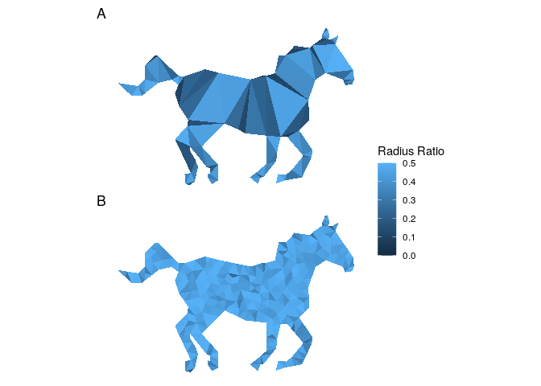

## Overview

Investigating mesh attributes in fitting LGCPs using the INLA-SPDE
approach.

**Note**: The radius-edge ratio of a polygon *τ* is given by
$re = \\frac{R}{l\_{\\text{min}}}$, where R is the circumradius and
*l*min is the length of the shortest edge. The radius ratio
$rr = \\frac{r}{R}$, where *r* is the inradius.

We can visualise each triangle measure:

## Files

-   `functions.r` contains a number of function to calculate different
    metrics measures and attributes. The main function
    `get_triag_attributes()` takes a `inla.mesh.2d()` object and returns
    a named list of length three:

    -   `edges` a dataframe of mesh segments  
    -   `triangles` a dataframe with, for each triangle in the
        triangulation, the circumcircle and incircle radii, the
        associated centroid locations, and the radius-edge ratio &
        radius ratio,
    -   `angles` is a 3 x nvert dataframe of all triangle interior
        angles

-   `data/ufo.csv` subset of data sourced from the [UFO Sightings
    Map](https://www.arcgis.com/apps/webappviewer/index.html?id=ddda71d5211f47e782b12f3f8d06246e)
    collated [here](https://data.world/timothyrenner/ufo-sightings#).
    Data for 2020 only and excludes sightings in Alaska and Hawaiʻi.

<!-- -->

    ufo <- readr::read_csv("data/ufo.csv")
    ufo

    ## # A tibble: 5,785 × 13
    ##    summary   city   state  date_time           shape duration stats  report_link
    ##    <chr>     <chr>  <chr>  <dttm>              <chr> <chr>    <chr>  <chr>      
    ##  1 Driving … Brady  Texas  2020-01-29 19:45:00 light Lights … Occur… http://www…
    ##  2 meteor o… San D… Calif… 2020-01-29 20:10:00 fire… 2 secon… Occur… http://www…
    ##  3 Shaped l… Las V… Nevada 2020-01-28 15:30:00 tria… 30       Occur… http://www…
    ##  4 I notice… Bear   Delaw… 2020-01-22 09:35:00 tria… 3 minut… Occur… http://www…
    ##  5 White re… Port … Flori… 2020-01-22 10:32:00 rect… 10 seco… Occur… http://www…
    ##  6 Large Mo… Battl… Michi… 2020-01-22 19:18:00 light 2 minut… Occur… http://www…
    ##  7 Seen 3 m… Detro… Michi… 2020-01-20 15:00:00 flash 45 minu… Occur… http://www…
    ##  8 I looked… Idaho… Idaho  2020-01-06 18:45:00 <NA>  <NA>     Occur… http://www…
    ##  9 Bright l… Comme… Ohio   2020-01-01 20:08:00 <NA>  3 secon… Occur… http://www…
    ## 10 A contra… Harri… Virgi… 2020-01-06 13:45:00 unkn… 15 minu… Occur… http://www…
    ## # … with 5,775 more rows, and 5 more variables: text <chr>, posted <dttm>,
    ## #   city_latitude <dbl>, city_longitude <dbl>, year <dbl>
