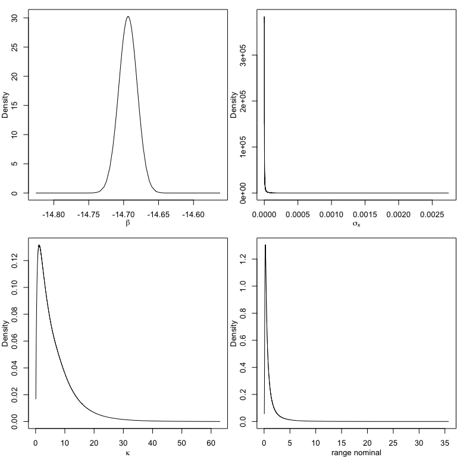
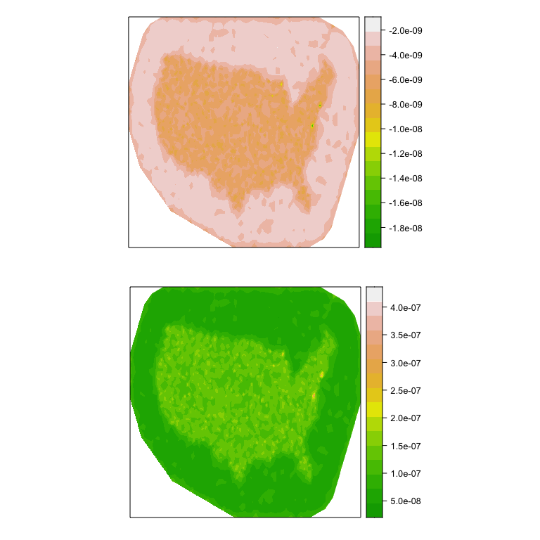
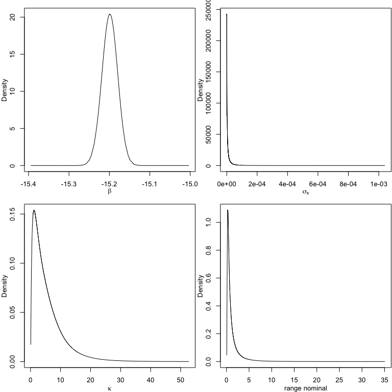

## Modelling UFO locations as a log-Gaussian Cox process

#### Packages

    library(INLA)

    ## Loading required package: Matrix

    ## Loading required package: foreach

    ## Loading required package: parallel

    ## Loading required package: sp

    ## This is INLA_21.11.22 built 2021-11-21 16:13:28 UTC.
    ##  - See www.r-inla.org/contact-us for how to get help.
    ##  - To enable PARDISO sparse library; see inla.pardiso()

    library(maps)
    library(sf)

    ## Linking to GEOS 3.8.1, GDAL 3.2.1, PROJ 7.2.1; sf_use_s2() is TRUE

    library(sp)
    library(ggplot2)
    library(patchwork)
    source("functions.r") ## source required functions

#### The Data and US map

    ## read in data
    ufo <- readr::read_csv("data/ufo.csv")

    ## Rows: 5785 Columns: 13

    ## ── Column specification ────────────────────────────────────────────────────────
    ## Delimiter: ","
    ## chr  (8): summary, city, state, shape, duration, stats, report_link, text
    ## dbl  (3): city_latitude, city_longitude, year
    ## dttm (2): date_time, posted

    ## 
    ## ℹ Use `spec()` to retrieve the full column specification for this data.
    ## ℹ Specify the column types or set `show_col_types = FALSE` to quiet this message.

    ## us map
    states <- map_data("state")
    usa <- map_data('usa')
    usa_region <- data.frame(Longitude = usa$long, Latitude = usa$lat)

Then, convert the existing lat-long coordinates to UTM (easting-northing
system), using North America Lambert Conformal Conic.

    ## define region and points
    region <- as(sf::st_as_sf(maps::map("usa", fill = TRUE, plot = FALSE)), "Spatial")
    locs <- data.frame(x = ufo$city_longitude, y = ufo$city_latitude)
    ufo_locs <- ufo
    coordinates(ufo_locs) <- c("city_longitude", "city_latitude")
    proj4string(ufo_locs) <- CRS('+init=epsg:4326') ## Setting default projection
    ufo_sp <- spTransform(ufo_locs,
                          CRS("+proj=lcc +lat_1=20 +lat_2=60 +lat_0=40 +lon_0=-96 +x_0=0 +y_0=0 +datum=NAD83 +units=m +no_defs "))
    # US region / domain
    usa_utm <- spTransform(region, 
                           CRS("+proj=lcc +lat_1=20 +lat_2=60 +lat_0=40 +lon_0=-96 +x_0=0 +y_0=0 +datum=NAD83 +units=m +no_defs"))

#### Mesh construction and weights

An example of mesh used for model UFO locations. The location of UFO are
used as initial triangulation nodes and use US shape to build a boundary
for the points.

    ufo_coo <- coordinates(ufo_sp)
    mesh <- inla.mesh.2d(loc = ufo_coo, boundary = inla.sp2segment(usa_utm), max.edge = c(75000,200000), cutoff = 50000)
    plot(mesh, asp=1)

    nv <- mesh$n ## number of vertices in the mesh
    n <- nrow(ufo) ## number of observations

    ## define the SPDE model
    ufo_spde <- inla.spde2.pcmatern(mesh = mesh, 
                                    alpha = 2,
                                    prior.range = c(0.1, 0.01), # P(range < 0.1) = 0.01
                                    prior.sigma = c(0.01, 0.01)) # P(sigma > 0.01) = 0.01
    dmesh <- book.mesh.dual(mesh)
    usabdy.sp <- SpatialPolygons(list(Polygons(list(Polygon(usa_utm)), ID = "1")))
    library(rgeos)

    ## rgeos version: 0.5-8, (SVN revision 679)
    ##  GEOS runtime version: 3.8.1-CAPI-1.13.3 
    ##  Please note that rgeos will be retired by the end of 2023,
    ## plan transition to sf functions using GEOS at your earliest convenience.
    ##  Linking to sp version: 1.4-5 
    ##  Polygon checking: TRUE

    usabdy.sp <- gBuffer(usabdy.sp, byid=TRUE, width=0)
    w <- sapply(1:length(dmesh), function(i) {
      if (gIntersects(dmesh[i, ], usabdy.sp)) 
        return(gArea(gIntersection(dmesh[i, ], usabdy.sp)))
      else 
        return(0) 
    })
    sum(w)

    ## [1] 13937200132

    table(w > 0)

    ## 
    ## FALSE  TRUE 
    ##  2805    16

#### Projector matrix and data stack

    y.pp <- rep(0:1, c(nv, n))
    e.pp <- c(w, rep(0, n))
    imat <- Diagonal(nv, rep(1, nv))
    lmat <- inla.spde.make.A(mesh, coordinates(ufo_sp))
    A.pp <- rbind(imat, lmat)
    ## the data stack
    stk.pp <- inla.stack(
      data = list(y = y.pp, e = e.pp),
      A = list(1, A.pp),
      effects = list(list(b0 = rep(1, nv + n)), list(i = 1:nv)),
      tag = 'pp')

#### Fitting the model with no covariate and some results

    pp.res <- inla(y ~ 0 + b0 + f(i, model = ufo_spde),
                   family = 'poisson', 
                   data = inla.stack.data(stk.pp),
                   control.predictor = list(A = inla.stack.A(stk.pp)),
                   control.compute = list(dic = TRUE, cpo = TRUE, waic = TRUE),
                   E = inla.stack.data(stk.pp)$e)
    ## transform to user scale
    pp.res.est <- inla.spde.result(inla = pp.res, name = "i", spde = ufo_spde, do.transf = TRUE)

    ## some results
    summary(pp.res)

    ## 
    ## Call:
    ##    c("inla(formula = y ~ 0 + b0 + f(i, model = ufo_spde), family = 
    ##    \"poisson\", ", " data = inla.stack.data(stk.pp), E = 
    ##    inla.stack.data(stk.pp)$e, ", " control.compute = list(dic = TRUE, cpo 
    ##    = TRUE, waic = TRUE), ", " control.predictor = list(A = 
    ##    inla.stack.A(stk.pp)))") 
    ## Time used:
    ##     Pre = 3.06, Running = 67.9, Post = 0.572, Total = 71.6 
    ## Fixed effects:
    ##       mean    sd 0.025quant 0.5quant 0.975quant    mode kld
    ## b0 -14.694 0.013     -14.72  -14.694    -14.668 -14.694   0
    ## 
    ## Random effects:
    ##   Name     Model
    ##     i SPDE2 model
    ## 
    ## Model hyperparameters:
    ##              mean    sd 0.025quant 0.5quant 0.975quant  mode
    ## Range for i 1.223 2.395      0.114    0.584      6.270 0.242
    ## Stdev for i 0.003 0.004      0.000    0.002      0.014 0.001
    ## 
    ## Deviance Information Criterion (DIC) ...............: 179711.05
    ## Deviance Information Criterion (DIC, saturated) ....: 178743.32
    ## Effective number of parameters .....................: -932.93
    ## 
    ## Watanabe-Akaike information criterion (WAIC) ...: 180533.41
    ## Effective number of parameters .................: 812.64
    ## 
    ## Marginal log-Likelihood:  -90800.89 
    ## CPO and PIT are computed
    ## 
    ## Posterior summaries for the linear predictor and the fitted values are computed
    ## (Posterior marginals needs also 'control.compute=list(return.marginals.predictor=TRUE)')

    pp.res$summary.fixed

    ##         mean        sd 0.025quant  0.5quant 0.975quant      mode          kld
    ## b0 -14.69375 0.0131979  -14.71976 -14.69372  -14.66795 -14.69365 9.215118e-07

    pp.res$summary.hyperpar

    ##                    mean          sd   0.025quant    0.5quant 0.975quant
    ## Range for i 1.222758768 2.394631601 0.1143577200 0.584196560 6.27002668
    ## Stdev for i 0.003128084 0.004154568 0.0002810908 0.001884441 0.01356195
    ##                     mode
    ## Range for i 0.2421191659
    ## Stdev for i 0.0007260311

    ## marginal posterior distribution
    par(mfrow=c(2,2), mar=c(3,3,1,0.1), mgp=2:0)
    plot(pp.res$marginals.fixed[[1]], type='l', xlab=expression(beta), ylab='Density') 
    plot(pp.res.est$marginals.variance.nominal[[1]], type='l', xlab=expression(sigma[x]), ylab='Density')
    plot(pp.res.est$marginals.kappa[[1]], type='l', xlab=expression(kappa), ylab='Density')
    plot(pp.res.est$marginals.range.nominal[[1]], type='l', xlab='range nominal', ylab='Density')

*Posterior distribution for the hyperparameters for *β*0,
*σ*2, *κ* and the nominal range.*

#### Projection on a grid

First, we calculate a grid projection from the `mesh` and we project the
posterior mean and the posterior standard deviation on the both grid.

    library(lattice)
    library(gridExtra)
    gproj <- inla.mesh.projector(mesh, dims = c(1000, 1000))
    g_mean <- inla.mesh.project(gproj, pp.res$summary.random$i$mean)
    g_sd <- inla.mesh.project(gproj, pp.res$summary.random$i$sd)
    do.call('grid.arrange',
            lapply(list(g_mean, g_sd),
                   levelplot, col.regions=terrain.colors(16),
                   scales=list(draw=FALSE), xlab='', ylab=''))

*The posterior mean and posterior variance for the random field without
covariate.*

## Including a covariate on the log-Cox process

#### Adding US population as covariate

-   US 2020 Cartographic Boundary Files downloaded from
    <https://www2.census.gov/geo/tiger/GENZ2020/shp/cb_2020_us_county_20m.zip>

-   2020 Census Demographic Data By County downloaded from
    <https://www.dataemporium.com/dataset/254/>

<!-- -->

    library(sf)
    library(dplyr)

    ## US 2020 Cartographic Boundary Files
    US20 <- st_read("data/cb_2020_us_county_20m/cb_2020_us_county_20m.shp")

    ## Reading layer `cb_2020_us_county_20m' from data source 
    ##   `/Users/haiyishi/Desktop/summer_demo/data/cb_2020_us_county_20m/cb_2020_us_county_20m.shp' 
    ##   using driver `ESRI Shapefile'
    ## Simple feature collection with 3221 features and 12 fields
    ## Geometry type: MULTIPOLYGON
    ## Dimension:     XY
    ## Bounding box:  xmin: -179.1743 ymin: 17.91377 xmax: 179.7739 ymax: 71.35256
    ## Geodetic CRS:  NAD83

    ## leave out AK, HI, and PR (state FIPS: 02, 15, and 72)
    conti_US20 <- US20[!(US20$STATEFP %in% c("02","15","72")), ]

    ## 2020 Census Demographic Data By County
    census20 <- read.csv("data/US_2020_census.csv")
    contiguous <- subset(census20, census20$STATE_ABBR != "AK" & census20$STATE_ABBR != "HI" & census20$STATE_ABBR != "PR")
    pop20 <- contiguous[, 1:3]

    ### append total population to US20
    conti_US20 <- arrange(conti_US20, NAMELSAD)
    pop20 <- arrange(pop20, COUNTY)
    conti_US20$TOT_POP <- pop20$TOTAL_POPULATION

    ### create shape object with state polygons
    us_pop20 <- conti_US20
    us_pop20 <- as(us_pop20, "Spatial")
    us_pop20 <- spTransform(us_pop20, 
                            CRS("+proj=lcc +lat_1=20 +lat_2=60 +lat_0=40 +lon_0=-96 +x_0=0 +y_0=0 +datum=NAD83 +units=m +no_defs"))
    pop_mesh <- sp::over(SpatialPoints(mesh$loc[,1:2], proj4string = CRS(proj4string(ufo_sp))), us_pop20)$TOT_POP
    pop_obs <- sp::over(ufo_sp, us_pop20)$TOT_POP
    covs <- data.frame(pop = c(pop_mesh, pop_obs))
    ## data stack
    stk.cov <- inla.stack(
      data = list(y = y.pp, e = e.pp), 
      A = list(1, A.pp),
      effects = list(list(b0 = rep(1, nv + n), pop = covs$pop), list(i = 1:nv)),
      tag = 'pp')

#### Fitting the model and some results

    pp.cov <- inla(y ~ 0 + b0 + pop + f(i, model = ufo_spde), 
                   family = 'poisson', data = inla.stack.data(stk.cov), 
                   control.predictor = list(A = inla.stack.A(stk.cov)), 
                   control.compute = list(dic = TRUE, cpo = TRUE, waic = TRUE),
                   E = inla.stack.data(stk.pp)$e)
    ## transfer
    pp.cov.est <- inla.spde.result(inla = pp.cov, name = "i", spde = ufo_spde, do.transf = TRUE)
    ## coefficients of the fixed effects
    summary(pp.cov)

    ## 
    ## Call:
    ##    c("inla(formula = y ~ 0 + b0 + pop + f(i, model = ufo_spde), family = 
    ##    \"poisson\", ", " data = inla.stack.data(stk.cov), E = 
    ##    inla.stack.data(stk.pp)$e, ", " control.compute = list(dic = TRUE, cpo 
    ##    = TRUE, waic = TRUE), ", " control.predictor = list(A = 
    ##    inla.stack.A(stk.cov)))") 
    ## Time used:
    ##     Pre = 3.21, Running = 31.6, Post = 0.0927, Total = 34.9 
    ## Fixed effects:
    ##        mean   sd 0.025quant 0.5quant 0.975quant    mode kld
    ## b0  -15.199 0.02    -15.238  -15.199    -15.161 -15.199   0
    ## pop   0.000 0.00      0.000    0.000      0.000   0.000   0
    ## 
    ## Random effects:
    ##   Name     Model
    ##     i SPDE2 model
    ## 
    ## Model hyperparameters:
    ##              mean    sd 0.025quant 0.5quant 0.975quant  mode
    ## Range for i 1.358 2.411      0.137    0.691      6.719 0.298
    ## Stdev for i 0.003 0.003      0.000    0.002      0.011 0.001
    ## 
    ## Deviance Information Criterion (DIC) ...............: 176944.99
    ## Deviance Information Criterion (DIC, saturated) ....: 175977.26
    ## Effective number of parameters .....................: -1363.07
    ## 
    ## Watanabe-Akaike information criterion (WAIC) ...: 180679.43
    ## Effective number of parameters .................: 1437.94
    ## 
    ## Marginal log-Likelihood:  -89870.34 
    ## CPO and PIT are computed
    ## 
    ## Posterior summaries for the linear predictor and the fitted values are computed
    ## (Posterior marginals needs also 'control.compute=list(return.marginals.predictor=TRUE)')

    pp.cov$summary.fixed

    ##              mean           sd    0.025quant      0.5quant    0.975quant
    ## b0  -1.519897e+01 1.956116e-02 -1.523755e+01 -1.519891e+01 -1.516076e+01
    ## pop  1.009386e-06 2.179942e-08  9.665209e-07  1.009408e-06  1.052088e-06
    ##              mode          kld
    ## b0  -1.519878e+01 9.191876e-07
    ## pop  1.009453e-06 9.508536e-07

    pp.cov$summary.hyperpar

    ##                    mean          sd   0.025quant    0.5quant 0.975quant
    ## Range for i 1.358092121 2.411269307 0.1367288389 0.691021496 6.71875297
    ## Stdev for i 0.002968076 0.002985776 0.0003667666 0.002095864 0.01083559
    ##                     mode
    ## Range for i 0.2980815532
    ## Stdev for i 0.0009763474

    par(mfrow=c(2,2), mar=c(3,3,1,0.1), mgp=2:0) 
    plot(pp.cov$marginals.fixed[[1]], type='l', xlab=expression(beta), ylab='Density') 
    plot(pp.cov.est$marginals.variance.nominal[[1]], type='l', xlab=expression(sigma[x]), ylab='Density')
    plot(pp.cov.est$marginals.kappa[[1]], type='l', xlab=expression(kappa), ylab='Density')
    plot(pp.cov.est$marginals.range.nominal[[1]], type='l', xlab='range nominal', ylab='Density')

*Posterior distribution for the hyperparameters for *β*0,
*σ*2, *κ* and the nominal range.*

#### Projection on a grid

    g_mean_cov <- inla.mesh.project(gproj, pp.cov$summary.random$i$mean)
    g_sd_cov <- inla.mesh.project(gproj, pp.cov$summary.random$i$sd)
    do.call('grid.arrange',
            lapply(list(g_mean_cov, g_sd_cov),
                   levelplot, col.regions=terrain.colors(16),
                   scales=list(draw=FALSE), xlab='', ylab=''))

*The posterior mean and posterior variance for the random field with
covariate.*
